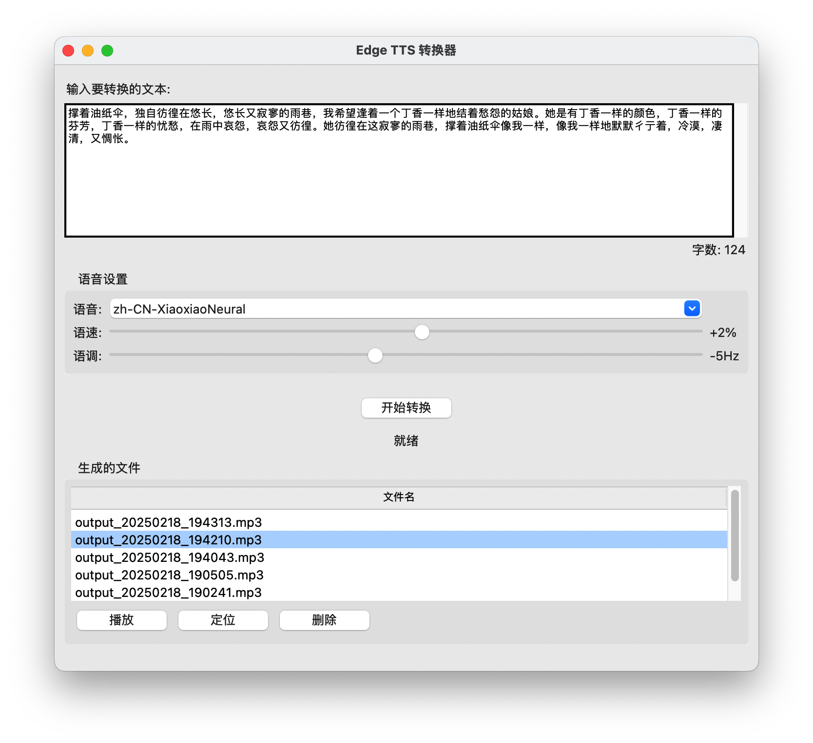

# Edge TTS 转换器

这是一个基于Edge TTS引擎的文字转语音工具，提供了简单直观的图形界面，让用户可以轻松地将文字转换为语音文件。

## 功能特点

- 支持多种中英文语音选择
- 可调节语速和语调
- 实时显示文本字数统计
- 自动保存生成的音频文件
- 支持音频文件的播放、定位和删除操作
- 简洁美观的图形界面

## 安装说明

1. 确保您的系统已安装Python 3.7或更高版本
2. 克隆或下载本项目到本地
3. 安装所需依赖包：
   ```bash
   pip install -r requirements.txt
   ```

## 软件界面



软件界面采用简洁直观的设计，主要包括以下区域：
- 左侧：文本输入区域，用于输入需要转换的文字
- 右上：语音设置区域，可选择语音类型并调节语速和语调
- 右下：文件列表区域，显示已生成的语音文件，支持播放、定位和删除操作

## 使用方法

1. 运行程序：
   ```bash
   python tts_app.py
   ```

2. 在文本输入区域输入要转换的文字

3. 选择语音类型：
   - zh-CN-XiaoxiaoNeural：小筱（女声）
   - zh-CN-YunxiNeural：云希（男声）
   - zh-CN-YunjianNeural：云健（男声）
   - zh-CN-XiaoyiNeural：小艺（女声）
   - en-US-JennyNeural：Jenny（英语女声）
   - en-US-GuyNeural：Guy（英语男声）

4. 调节语速和语调：
   - 语速：-50% 到 +50%
   - 语调：-50Hz 到 +50Hz

5. 点击"开始转换"按钮

6. 转换完成后，可以在文件列表中：
   - 播放：试听生成的语音文件
   - 定位：在文件管理器中查看文件位置
   - 删除：删除不需要的语音文件

## 示例展示

### 示例文本

暮色漫过江畔时，最后一缕斜阳正将芦苇染成琥珀色。碎金般的光斑在粼粼水纹间跳跃，像谁失手打翻了盛满黄昏的陶罐。渔舟剪开绸缎似的水面，桨声搅碎半江云霞，惊起两三白鹭掠过苍青色的天际线。老渔夫立在船头，竹篙轻点处荡开圈圈年轮般的涟漪。鸬鹚敛翅静立，羽翼上凝着暮色与霜色交织的微光。对岸山影渐次模糊，黛色轮廓被炊烟洇成水墨画里湿润的笔触。忽有晚钟自古寺飘来，声波推着半片枫叶在漩涡里打转，最终沉入水底星子初现的倒影。暮色如淡墨在宣纸上层层晕染，将天地收进青瓷盏般的静谧里。风起时，芦苇低伏成浪，沙沙声里藏着某个未及诉说的古老故事，随江水流向月光升起的远方。

### 示例音频

### 在线试听

<!-- 方案1：HTML5 Audio标签 -->
<audio id="audioPlayer" controls preload="none" controlsList="nodownload">
  <source src="https://raw.githubusercontent.com/dahebro/gen_voice_by_Edge_tts/main/examples/output_20250223_211304.mp3" type="audio/mpeg">
</audio>

<!-- 方案2：使用第三方播放器 -->
<div id="aplayer"></div>

<!-- 方案3：直接下载链接 -->
<p>如果无法直接播放，请<a href="https://raw.githubusercontent.com/dahebro/gen_voice_by_Edge_tts/main/examples/output_20250223_211304.mp3" download="示例音频.mp3">点击此处下载</a>音频文件。</p>

<!-- 引入APlayer播放器 -->
<link rel="stylesheet" href="https://cdn.jsdelivr.net/npm/aplayer/dist/APlayer.min.css">
<script src="https://cdn.jsdelivr.net/npm/aplayer/dist/APlayer.min.js"></script>

<script>
  // 初始化APlayer播放器
  const ap = new APlayer({
    container: document.getElementById('aplayer'),
    audio: [{
      name: '示例音频',
      artist: 'Edge TTS',
      url: 'https://raw.githubusercontent.com/dahebro/gen_voice_by_Edge_tts/main/examples/output_20250223_211304.mp3',
      cover: 'https://raw.githubusercontent.com/dahebro/gen_voice_by_Edge_tts/main/images/interface.png'
    }]
  });
</script>

## 注意事项

- 生成的语音文件将以"output_时间戳.mp3"格式保存在程序运行目录下
- 转换过程中请保持网络连接
- 建议每次转换的文本长度适中，过长的文本可能需要更多处理时间

## 技术依赖

- Python 3.7+
- edge-tts
- tkinter
- pygame
- asyncio

## 许可证

本项目采用MIT许可证。欢迎使用和改进。

## 联系作者

如果您在使用过程中有任何建议或需要交流，欢迎添加作者微信：dahebro（请备注：github）